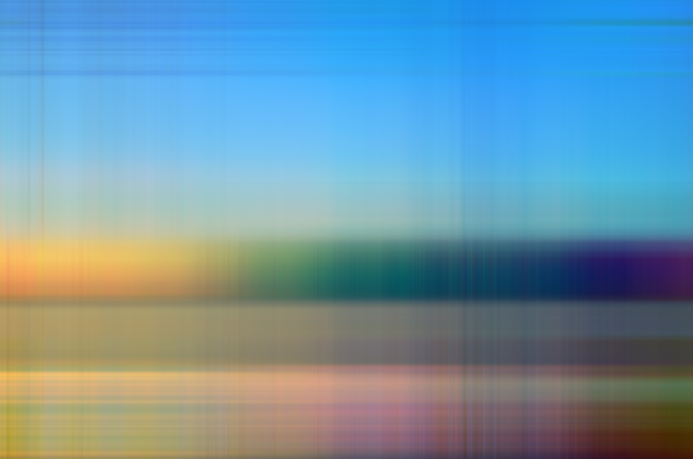

# image-approx
This tool aims at computing an approximation of a given image by applying SVD to it.  
A possible application of such tool may be the creation of abstract images, where the level of abstractness depends on the choice of *k*, the degree of approximation.
## Example
Given the following stock image:

it is possible to obtain an highly abstract image like the following:

by setting a low degree (e.g. *k=2*).

By increasing the value of *k*, a progressively more highly-detailed approximation is obtained, like the following (*k=50*):

The upper bound of *k* is the number of eigenvalues obtained by SVD; to find out such number, the script must be run first, so it is suggested to initially set a low *k* (by default, *k=2*).

#### Author:
Mattia Orlandi